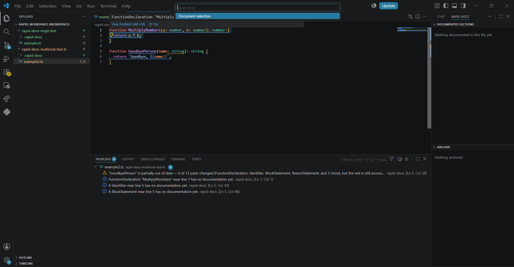
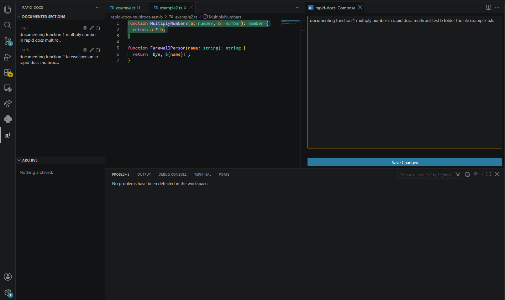
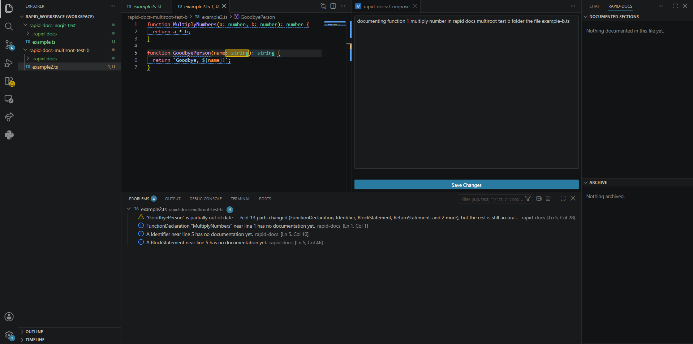
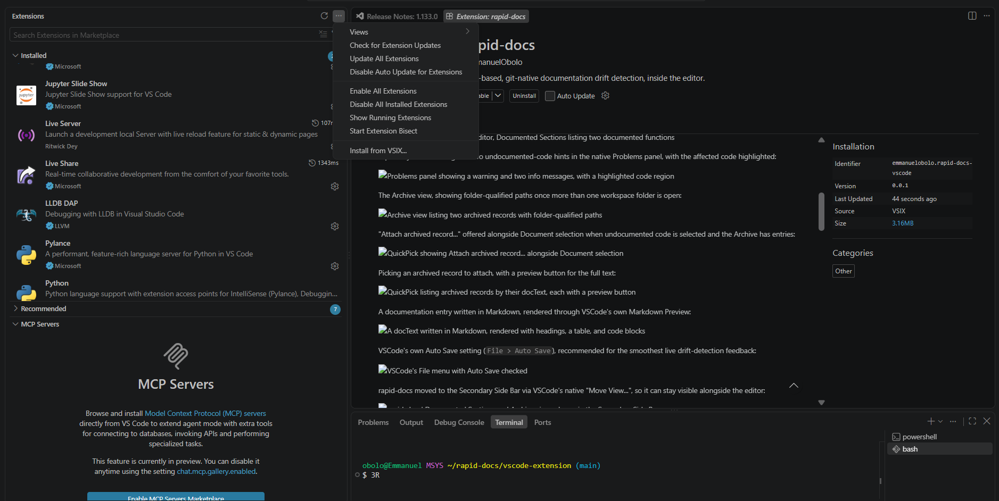

<p align="center">
  
</p>

# rapid-docs


AST-based, git-native documentation drift detection: hand-written documentation that stays attached to code *structure*, not to line numbers. A note you write for a function stays correct even after the function moves, gets reformatted, or has code added around it, and gets flagged the moment the code it actually describes changes underneath it.

> **Status: the [VS Code extension](vscode-extension/) is now the primary way to use rapid-docs (v0.1.0).** The original Electron desktop app (v0.1.0) is deprecated in favor of it -- kept in this repo for reference, not actively developed further. Both share the same underlying NestJS/AST backend. Not yet on the VS Code Marketplace (pending an account issue on the publishing side); in the meantime, install it from a packaged `.vsix` -- see [Getting started](#getting-started) below.

## Screenshots

Running `rapid-docs: Document selection` from the Command Palette, with the Problems panel already showing undocumented and drifted code:



The Compose panel open beside the editor, with Documented Sections listing documented functions in the sidebar:



A partially-stale warning and undocumented-code hints in the native Problems panel, with the affected code highlighted:



More screenshots (Archive, attaching archived records, Markdown-rendered previews, and the full feature list) are in the [VS Code extension's own README](vscode-extension/README.md#screenshots).

## The problem this solves

Anytime you write code, you often want to explain your solution and the thought process behind it: why you picked one approach over another, what a piece of state is actually tracking, what would break if it were done differently. The natural place to put that is directly in the file, as a comment. But that forces a bad tradeoff: explain it fully, and the code gets cramped and hard to actually see underneath all the documentation; keep it short so the code stays clean, and the explanation isn't detailed enough to be useful.

rapid-docs exists so you can fully explain and fully express your reasoning without cramping up the code with documentation. The documentation lives outside the file entirely, but stays attached to the exact code it's about.

An ordinary comment gets its connection to the right code for free, since it's physically sitting right above it in the same text. Move the note somewhere else, and that connection has to be built deliberately, since nothing about the note's position tells you what it's about anymore. rapid-docs' answer is to anchor a note to a specific **AST node** (a function, a block, an expression) instead of a position. Because the link is structural rather than positional, whitespace changes, reordering, and reformatting don't break it, but an actual change to the documented code's shape does, and gets surfaced as drift.

## How it works

1. Select a piece of code and write documentation for it.
2. rapid-docs snaps your selection to the AST nodes within that highlighted section and stores a structural fingerprint of it: not the raw text, and not the line numbers the selection happened to occur at.
3. From then on, every real file save is checked against that fingerprint. If the documented node's structure has genuinely changed, it's reported as drift; if the code around it changed but the node itself didn't, nothing fires.

Documentation is stored as plain JSON, one file per source file, inside a `.rapid-docs/` folder next to the code it describes: versionable in the same repo, readable without any of the tools below, and requiring no external database.

## Architecture

- **Backend**: a NestJS application (dependency-injected services, not an HTTP server) providing:
  - AST parsing and structural fingerprinting (`@babel/parser`/`@babel/types`)
  - Git integration: commit-based diffing for drift checks on every commit, and live file-watching (`chokidar`, gitignore-aware) for changes that haven't been committed yet
  - Documentation storage and drift/message reporting
- **VS Code extension** (`vscode-extension/`, primary interface): native Problems-panel diagnostics, a Webview Compose panel for writing documentation beside the editor, sidebar views for Documented Sections and Archive, and full multi-root workspace support. Bundled via esbuild into a single self-contained `dist/extension.js` (the compiled backend included), so it has no dependency on this repo's own layout once packaged. See its own [README](vscode-extension/README.md) for the full feature list.
- **Electron desktop app** (`electron/`, deprecated): a Monaco-based editor shell that talks to the same NestJS backend via `NestFactory.createApplicationContext`, in-process. Kept in the repo as-is; not actively developed further now that the extension has full parity plus native VS Code integration Electron never had.

## Getting started

### VS Code extension (recommended)

Not yet on the Marketplace. Install the packaged extension directly:

1. Download the latest `.vsix` from [Releases](../../releases).
2. In VS Code: Extensions view -> **"..."** menu -> **Install from VSIX...** -> pick the downloaded file.



To build it yourself instead:

```bash
cd vscode-extension
npm install
npm run compile   # builds the shared backend, then bundles the extension
npx vsce package  # produces a real, installable .vsix
```

### Electron desktop app (deprecated)

Requires Node.js and npm.

```bash
npm install
npm run start:electron
```

This builds both the backend and the Electron shell and launches the app. Individual steps, if you need them:

```bash
npm run build            # NestJS backend -> dist/
npm run build:electron   # Electron main/preload -> electron/dist/, plus static assets
npm test                 # full Jest suite (shared backend, used by both)
```

## License

MIT. See [LICENSE](LICENSE).
