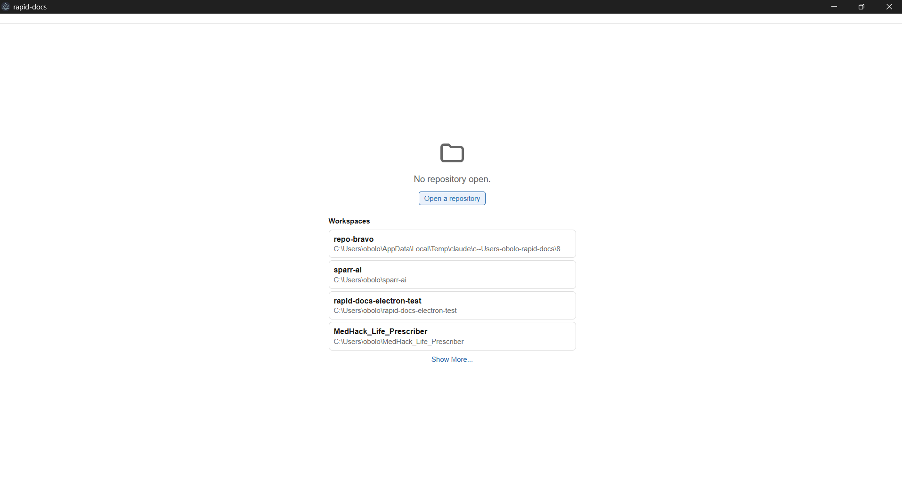
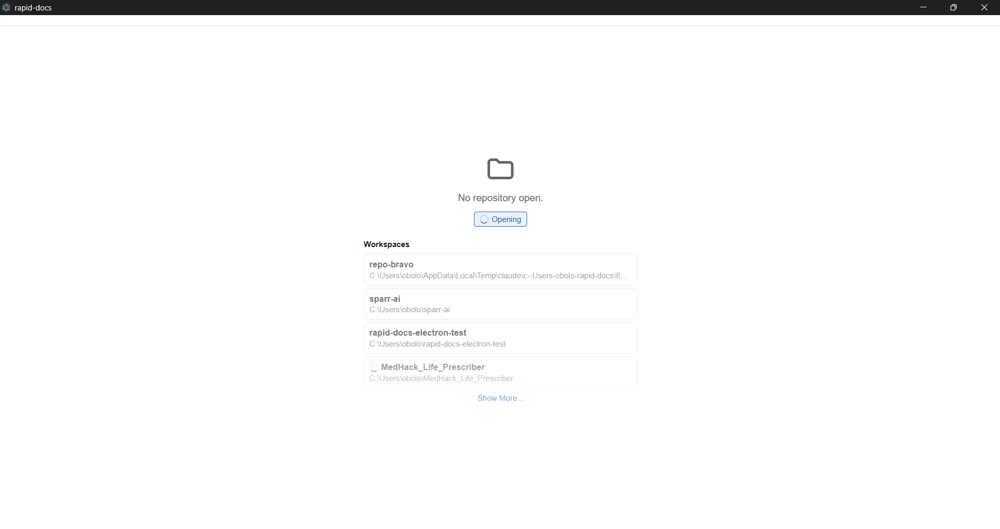
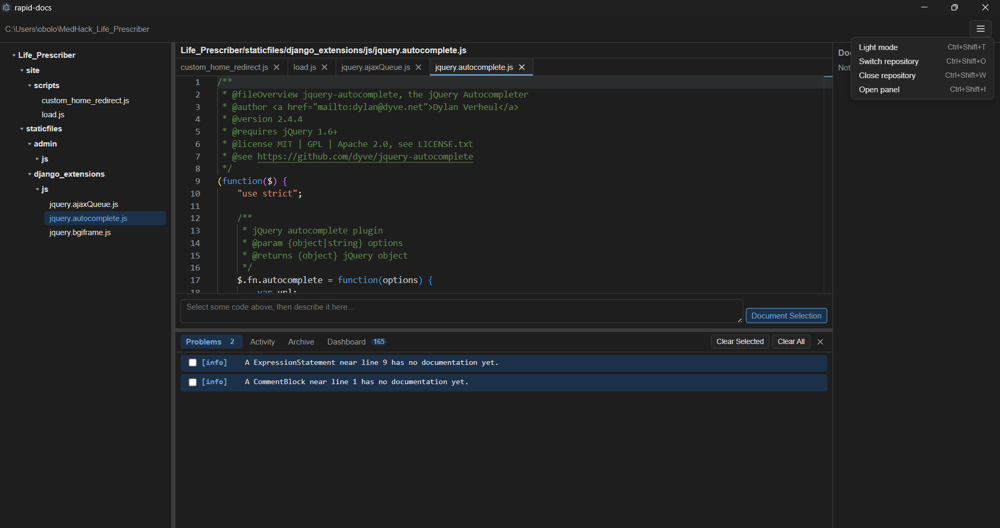
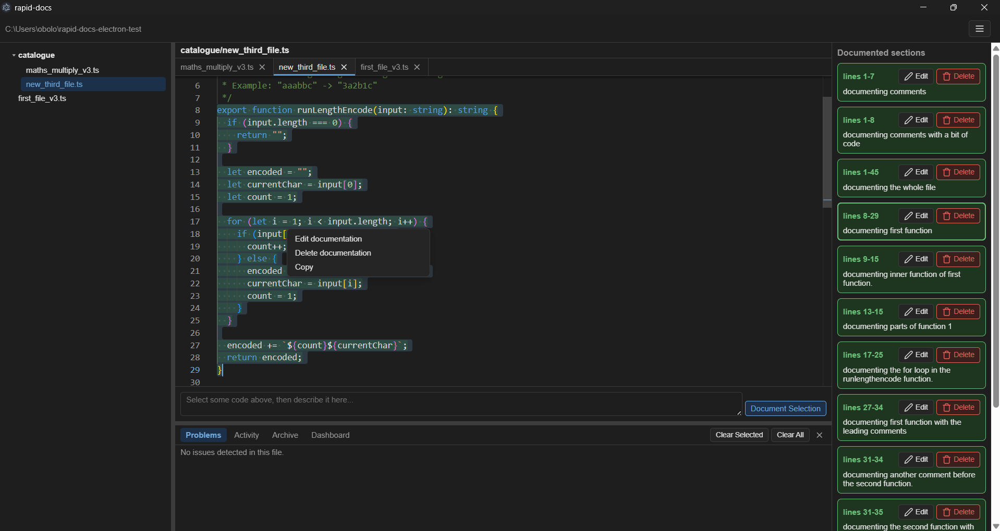
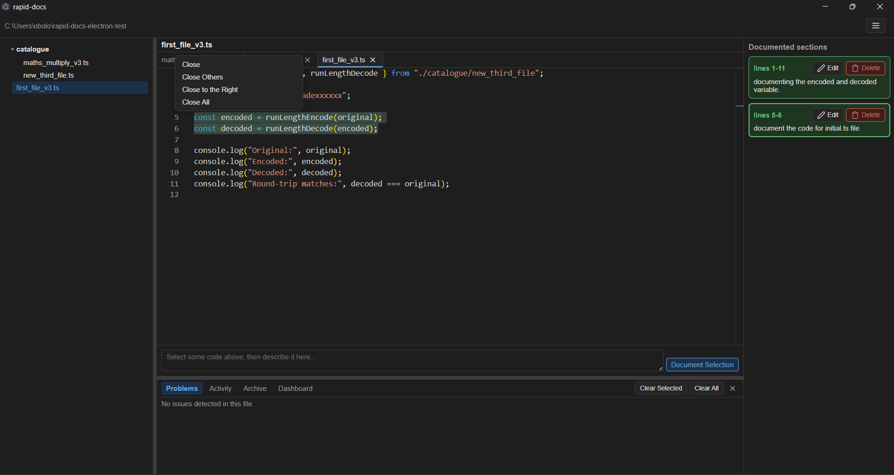

# rapid-docs

A desktop tool that keeps hand-written documentation attached to code *structure*, not to line numbers. A comment/note you write for a function stays correct even after the function moves, gets reformatted, or has code added around it, and gets flagged the moment the code it actually describes changes underneath it.

> Status: **v0.1.0**, actively developed, Windows-only for now. Built as a personal project to explore AST-based tooling end to end; expect rough edges, and issues are welcome.

## Screenshots

No repository open yet, picking from recently used workspaces:



Opening a repository, with per-workspace loading feedback:



A real repository open, with multiple tabs, the Problems panel, and the top-bar menu:



The Documented sections panel, with edit/delete/copy on a selected node:



Right-clicking a tab for VS Code-style close options:



## The problem this solves

Most "documentation" ends up as either:
- A comment glued to a specific line, which silently goes stale the moment the code around it shifts, or
- A wiki page nobody remembers to update, disconnected from the code entirely.

rapid-docs instead documents a specific **AST node** (a function, a block, an expression) inside a real file in a real git repo. Because the link is structural rather than textual, whitespace changes, reordering, and reformatting don't break it, but an actual change to the documented code's shape does, and gets surfaced as drift.

## How it works

1. Open a local git repository in the app.
2. Select a piece of code in the editor and write a short description for it.
3. rapid-docs snaps your selection to the nearest enclosing AST node and stores a structural fingerprint of it: not the raw text, and not a line number.
4. From then on, every commit and every live file save is checked against that fingerprint. If the documented node's structure has genuinely changed, it's reported as drift; if the code around it changed but the node itself didn't, nothing fires.

Documentation is stored as plain JSON, one file per source file, inside a `.rapid-docs/` folder next to the code it describes: versionable in the same repo, readable without the app, and requiring no external database.

## Architecture

- **Backend**: a NestJS application (dependency-injected services, not an HTTP server) providing:
  - AST parsing and structural fingerprinting (`@babel/parser`/`@babel/types`)
  - Git integration: commit-based diffing for drift checks on every commit, and live file-watching (`chokidar`, gitignore-aware) for changes that haven't been committed yet
  - Documentation storage and drift/message reporting
- **Desktop shell**: Electron, with a Monaco-based editor for viewing and selecting code (read-only with respect to the code itself; rapid-docs never edits or saves the files it documents), tabs for multiple open files, and panels for Problems, Documented sections, Archive, and a live Dashboard.
- The Electron main process talks to the NestJS backend via `NestFactory.createApplicationContext`, in-process, with no separate server to run.

## Getting started

Requires Node.js and npm.

```bash
npm install
npm run start:electron
```

This builds both the backend and the Electron shell and launches the app. Individual steps, if you need them:

```bash
npm run build        # NestJS backend -> dist/
npm run build:electron  # Electron main/preload -> electron/dist/, plus static assets
npm test              # full Jest suite
```

## License

MIT. See [LICENSE](LICENSE).
