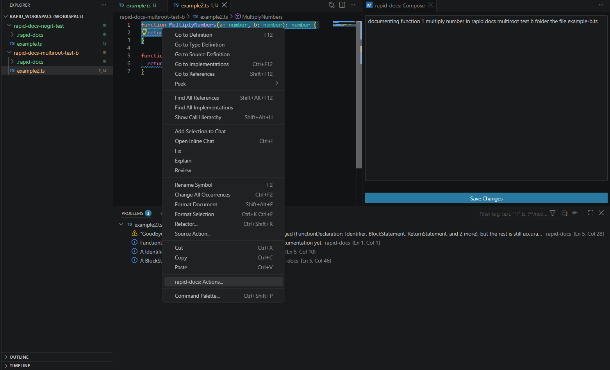
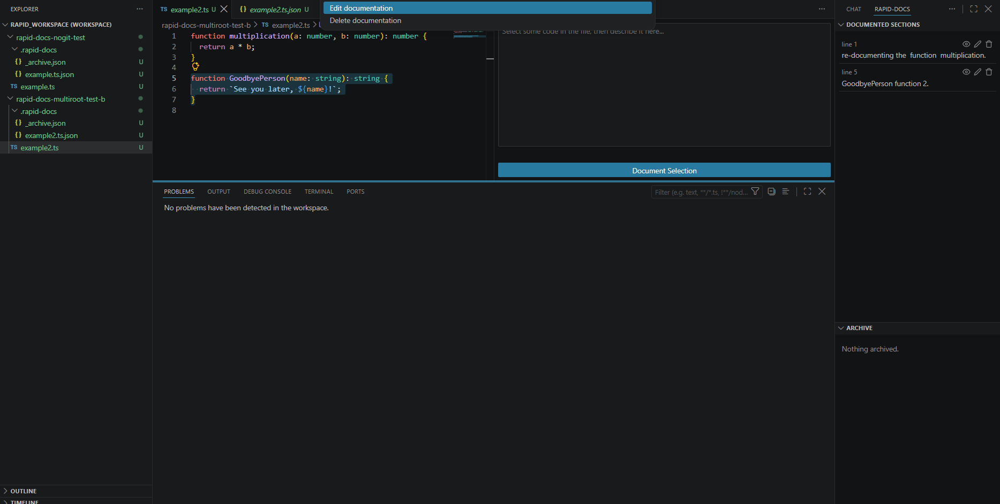
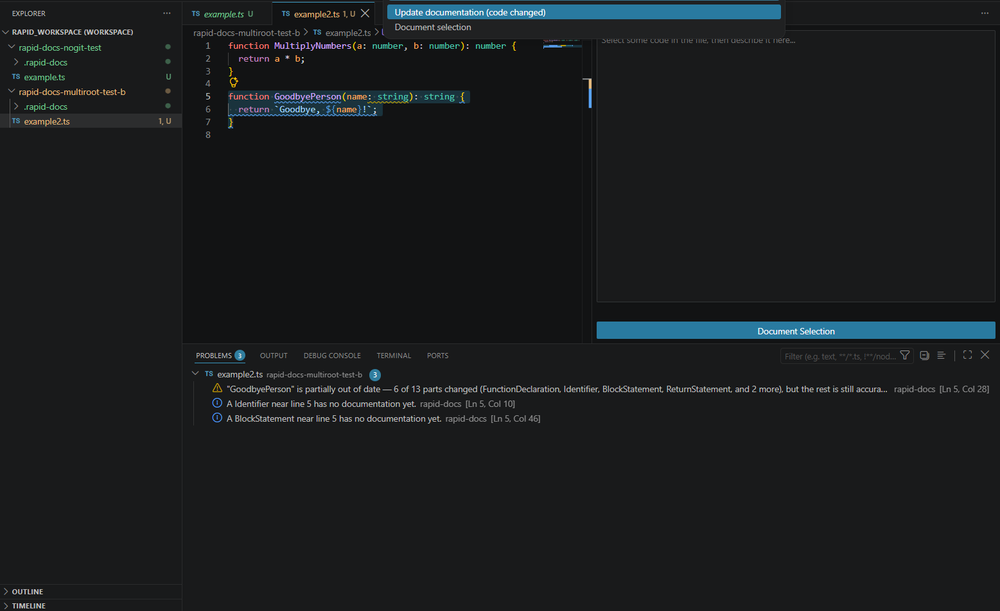
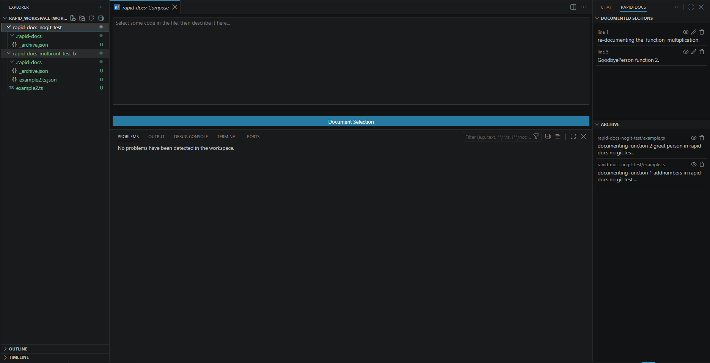
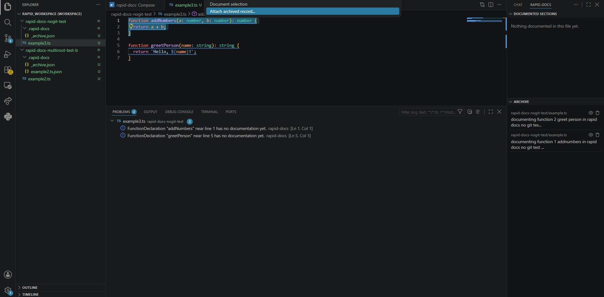
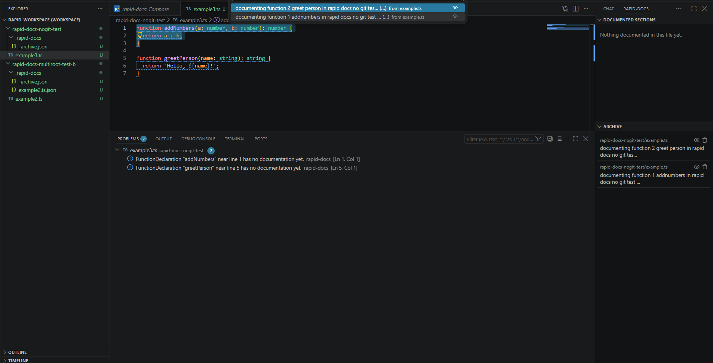
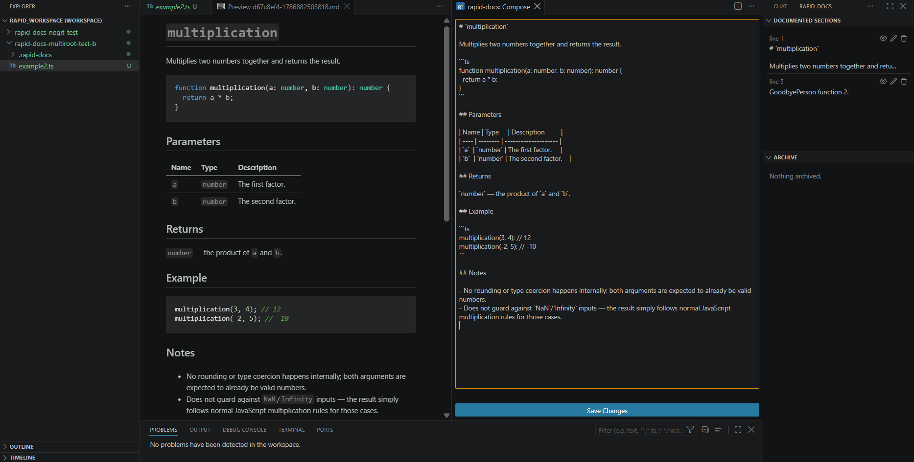
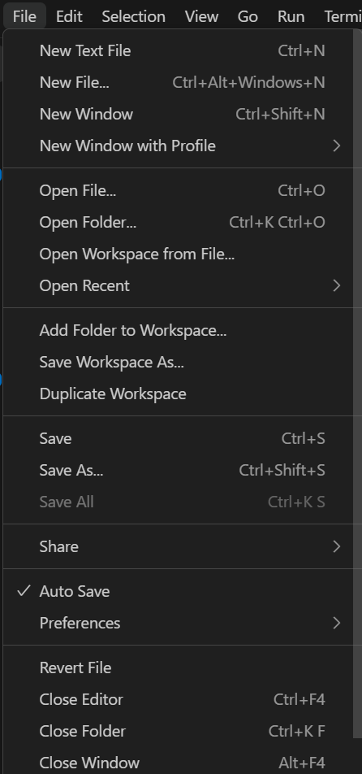
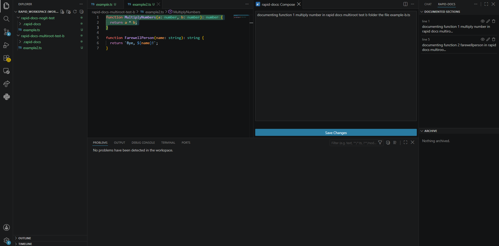

  

# rapid-docs

AST-based, git-native documentation drift detection, inside the editor.

> Status: early, actively developed. Built as a VSCode extension from the ground up, reusing the same NestJS/AST backend as the original rapid-docs desktop app, which is now deprecated in favor of this extension.

## Screenshots

Running `rapid-docs: Document selection` from the Command Palette, with the Problems panel already showing undocumented and drifted code:

Right-clicking selected code opens `rapid-docs: Actions...` alongside VSCode's own native menu items:

Selecting already-documented code offers Edit or Delete:

Selecting code with a drifted record offers Update documentation, alongside Document selection:

The Compose panel open beside the editor, with Documented Sections listing both functions in the sidebar:

A partially-stale warning and two undocumented-code hints in the native Problems panel, with the affected code highlighted:

The Archive view, showing folder-qualified paths once more than one workspace folder is open:

"Attach archived record..." offered alongside Document selection when undocumented code is selected and the Archive has entries:

Picking an archived record to attach, with a preview button for the full text:

A documentation entry written in Markdown, rendered through VSCode's own Markdown Preview:

VSCode's own Auto Save setting (`File > Auto Save`), recommended for the smoothest live drift-detection feedback:

rapid-docs moved to the Secondary Side Bar via VSCode's native "Move View...", so it can stay visible alongside the editor:

## The problem this solves

Anytime you write code, you often want to explain your solution and the thought process behind it: why you picked one approach over another, what a piece of state is actually tracking, what would break if it were done differently. The natural place to put that is directly in the file, as a comment or documentation. But that forces a bad tradeoff: explain it fully, and the code gets cramped and hard to actually see underneath all the documentation; keep it short so the code stays clean, and the explanation isn't detailed enough to be useful.

rapid-docs exists so you can fully explain and fully express your reasoning without cramping up the code with documentation. The documentation lives outside the file entirely, but stays attached to the exact code it's about.

An ordinary comment gets its connection to the right code for free, since it's physically sitting right above it in the same text. Move the note somewhere else, and that connection has to be built deliberately, since nothing about the note's position tells you what it's about anymore. rapid-docs' answer is to anchor a note to a specific **AST node** (a function, a block, an expression) instead of a position. Because the link is structural rather than positional, whitespace changes, reordering, and reformatting don't break it, but an actual change to the documented code's shape does, and gets surfaced as drift, right inside VSCode's own Problems panel.

## How it works

1. Select a piece of code in the editor and write documentation for it.
2. rapid-docs snaps your selection to the AST nodes within that highlighted section and stores a structural fingerprint of it: not the raw text, and not the line numbers the selection happened to occur at.
3. From then on, every real file save is checked against that fingerprint. If the documented node's structure has genuinely changed, it's reported as drift; if the code around it changed but the node itself didn't, nothing fires.

Documentation is stored as plain JSON, one file per source file, inside a `.rapid-docs/` folder next to the code it describes: versionable in the same repo, readable without the extension, and requiring no external database.

## Features

**Document selection** — select any code, run `rapid-docs: Document selection` (or right-click → `rapid-docs: Actions...`), and write documentation in the Compose panel that opens beside your editor. (This is VSCode's own "Webview Panel" concept, the same kind of surface as a diff view or a custom editor, not something docked in the sidebar.)

**Documented Sections** — a sidebar view listing every documented range in the current file, with preview, edit, and delete actions built in.

**Live drift detection** — documented code that changes shape shows up as a warning or error directly in VSCode's native Problems panel, the moment you save. rapid-docs watches the file on disk directly, independent of the editor, so it reacts to any real save, not just keystrokes; turning on VSCode's own Auto Save (`File > Auto Save`) gives the smoothest live feedback without you needing to save manually. A "Delete stale documentation" Quick Fix is offered when a record can no longer be resolved to a specific selection: either the code changed enough that nothing matches it anymore, or its remaining content matches more than one place in the file, so rapid-docs can't tell which one it actually documents.

**Right-click editor actions** — select code with existing documentation to Edit or Delete it; select undocumented code to Document it, pick up an Update prompt if the code has drifted, or Attach a previously archived record.

**Archive** — deleting a documented file (or the record itself) doesn't erase your writing. It's kept in a sidebar Archive view, where it can be previewed, permanently discarded, or re-attached to a different selection later. Viewing, previewing, discarding, and attaching existing archive entries all work regardless of git; see [Known quirks](#known-quirks) for when new entries actually get created.

**Activity log** — every real action (documented, updated, deleted, attached, discarded) is logged with a timestamp in its own "rapid-docs: Activity" Output channel, alongside VSCode's own Problems/Terminal/Debug Console.

**Multi-root workspace support** — open more than one folder at once and everything (Diagnostics, Compose, Documented Sections, Archive) scopes correctly per folder. Once more than one folder is open, Activity log entries and Archive rows show the folder name alongside the file path so it's always clear which folder an entry belongs to.

**Works in any folder, git or not** — rapid-docs never refuses to activate in a folder that isn't a git repository yet. Compose, Documented Sections, and viewing/managing whatever's already in the Archive all work immediately; drift detection, live file-watching, and adding new entries to the Archive activate automatically the moment a `.git` folder appears (for example, right after running `git init`), with no reload required.

## Requirements

None to get started, rapid-docs works in any open folder. Live drift detection, diagnostics, and automatic archiving on file deletion all require the folder to be (or become) a git repository; see [Known quirks](#known-quirks) below.

## Commands

Search "rapid-docs" in the Command Palette (`Ctrl+Shift+P`):

- **rapid-docs: Document selection** — open Compose for the current selection.
- **rapid-docs: Actions...** — the same context menu available via right-click on selected code.
- **rapid-docs: Show Documented Sections** / **rapid-docs: Show Archive** — reveal either sidebar view if it's hidden or moved. (VSCode also contributes its own "Focus on Documented Sections/Archive View" entries for the same views; both are kept intentionally, one native, one ours, as a redundant path to the same place.)

## Known quirks

- **Non-git folders work, but not at full strength, and this can look like something's broken when it isn't.** Until a folder becomes a git repository, Problems/diagnostics, live drift detection, and creating new Archive entries on file deletion are all inactive by design, not broken. Compose, Documented Sections, and viewing/discarding/attaching whatever's already in the Archive all work immediately regardless. Run `git init` (or use VSCode's own Source Control panel) once, and everything else activates automatically, no reload needed.
- **Documentation text is rendered as real Markdown when previewed, which can render unexpectedly if that wasn't intended.** The eye-icon preview (Documented Sections, Archive, the delete-stale Quick Fix) opens your docText through VSCode's own Markdown Preview, not a plain-text viewer, so headings, code blocks, tables, and bold/italic text all render properly if you write them. The flip side: a plain-text description that happens to start a line with `#`, `*`, or `|` gets interpreted as Markdown syntax too, and can render as a heading, list, or table instead of literal text. New to Markdown? See [GitHub's basic writing and formatting syntax guide](https://docs.github.com/en/get-started/writing-on-github/getting-started-with-writing-and-formatting-on-github/basic-writing-and-formatting-syntax).

## Storage format

`.rapid-docs/<relativePath>.json`, one file per documented source file, plus a shared `.rapid-docs/_archive.json` for archived records. Plain JSON, safe to commit alongside your code, readable without this extension installed.

## License

MIT. See the [repository root](../README.md) for the full project, including the original (now deprecated) desktop app this extension replaced.
